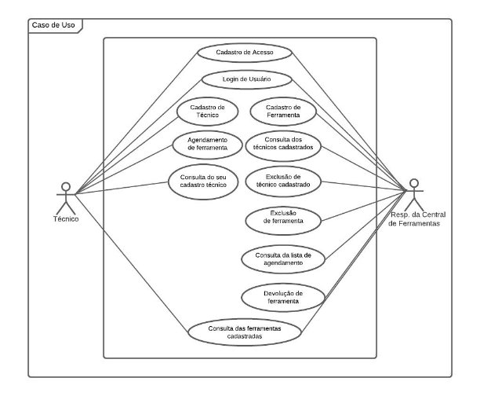
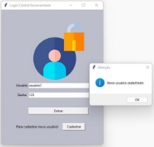
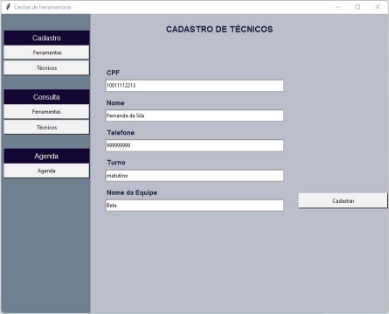
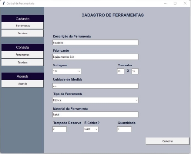
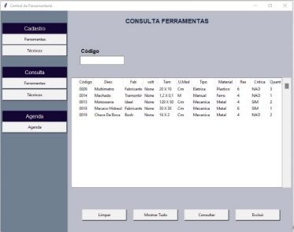
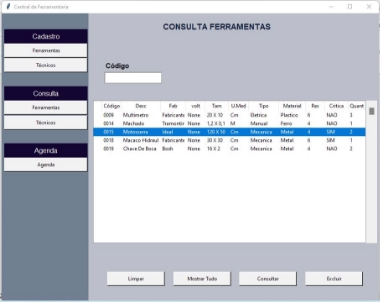
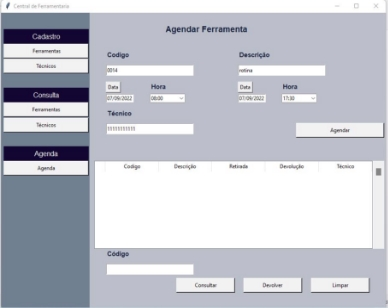



**Desenvolvimento Full Stack: Mundo 1** 

**Sistema de Agendamento de Ferramentas** 

Especificação de Requisitos e Documento do Projeto 

Semestre 2022.2 

___
**Stakeholder Principal:** Professor Roberto Maia (Mestre dos Magos) 

**Equipe do Projeto: Grupo 1** 
___
### **Integrante 1** 

**Nome:** Flávio Borges Nunes 

**Matrícula:** 202204485672 

**Atribuições:** Desenvolvimento backend/frontend,e integração com banco de dados construindo as funções de cadastro de agendamento, consulta e devolução no Módulo Agendamento. 
___
### **Integrante 2** 

**Nome:** João Gustavo Morielo 

**Matrícula:** 202204370913 

**Atribuições:** Participação nas reuniões de alinhamento. 
___
### **Integrante 3** 

**Nome:** Raila Nascimento Sousa 

**Matrícula:** 202204455331 

**Atribuições:** Levantamento dos requisitos, responsável pela documentação do projeto e apoio no desenvolvimento backend/frontend dos módulos Cadastro Técnico e Ferramenta; Consulta Técnico e Ferramenta. 
___
### **Integrante 4** 

**Nome:** Vinícius José da Silva 

**Matrícula:** 202205091031 

**Atribuições:** Desenvolvimento backend/frontend e integração com banco de dados construindo diversas funções nos módulos Cadastro/Login de usuário, Cadastro Técnico e Ferramenta, Consulta Técnico e Ferramenta. 
___
### **Sumário** 

1. SOBRE O PROJETO  
1. OBJETIVO DO DOCUMENTO  
1. REGRAS DE NEGÓCIOS 
1. USUÁRIOS E DIAGRAMA DE CASO DE USO 
1. REQUISITOS FUNCIONAIS  
1. REQUISITOS NÃO FUNCIONAIS  
1. INPUTS  
1. OUTPUTS  
1. FLUXO DOS PROCESSOS  
1. INTERFACE GRÁFICA  
1. VÍDEO DE FUNCIONAMENTO DO SISTEMA  

___

### 1. **SOBRE O PROJETO**

O projeto consiste no desenvolvimento de um Sistema de Agendamento de Ferramentas, que possibilitará aos técnicos de manutenção audiovisual, realizarem o agendamento de retirada e devolução de equipamentos. Será possível  ao responsável da central de ferramentaria realizar  a  gestão  do  sistema,  através  do  cadastro  e  consulta  de  todos  as  ferramentas existentes, consulta dos agendamentos e técnicos cadastrados. 
___

### 2. **OBJETIVO DO DOCUMENTO**

O objetivo deste documento é especificar as regras e detalhar o processo de cadastro de técnico, cadastro de ferramenta, consulta de técnico, consulta de ferramenta, agendamento de ferramenta e devolução de ferramenta. 
___

### 3. **REGRAS DE NEGÓCIOS**

* Reserva com até 24hs de antecedência.
* Central de ferramentas precisa ter ao menos 1 unidade de cada ferramenta crítica em estoque.
* As solicitações de reserva precisam ser enviadas por e-mail para o responsável da Central de Ferramentaria, com as informações do técnico responsável, ferramenta, data e hora da retirada e devolução.
* Cada ferramenta precisa ter um tempo máximo permitido para reserva.
* Todos os técnicos precisam ser cadastrados no sistema.
* Deve ser possível excluir o cadastro de Técnico e Ferramenta quando necessário.
* Reserva de ferramenta deve ficar associada ao técnico responsável pela retirada.
* Deve ser possível que o responsável pela Central de Ferramentaria realize a consulta de todas as ferramentas cadastradas, técnicos e agendamentos. 
___
### **4.  USUÁRIOS E DIAGRAMA DE CASO DE USO** 

* Responsável da Central de Ferramentas. 
* Técnico de Manutenção. 

___
### **5.  REQUISITOS FUNCIONAIS** 

1. Cadastro de acesso 
1. Login de usuário 
1. Cadastro do técnico, com validação através do CPF. 
1. Cadastro da ferramenta, com geração de código. 
1. Consulta da lista dos técnicos cadastrados. 
1. Exclusão de técnico cadastrado. 
1. Consulta da lista de ferramentas cadastradas. 
1. Exclusão de ferramenta cadastrada. 
1. Cadastro de agendamento de ferramenta, com técnico associado. 
1. Consulta da lista de agendamentos. 
1. Devolução de ferramenta, com exclusão na lista de agendamentos. 
___
### **6.  REQUISITOS NÃO FUNCIONAIS** 

1. Sistema multiplataforma (Windows, Linux e MacOS). 
2. Desenvolvido na linguagem Python. 
3. Para rodar o sistema é necessário executar o arquivo main.py e importar os módulos e suas funções. 
4. Sistema pode ser executado na IDE PyCharm, Visual Studio Code e outros. 
5. A execução do sistema deve ser realizada com acesso à internet para instalação de diferentes bibliotecas. 
6. Após instalação das bibliotecas, deve ser possível o programa funcionar no modo oflline. 
7. Tempo máximo de 60 segundos durante processamentos. 
8. Necessária a instalação dos seguintes pacotes para a execução do sistema: tkinter, csv, shutil, tempfile, tkcalendar, datetime. 
9. Interface gráfica será desenvolvida através da biblioteca Tkinter, de modo a oferecer boa usabilidade para o usuário, através de recursos intuitivos, como botões, formulários e listas de consultas. 
10. Os dados imputados (técnico, ferramenta, agendamentos) serão salvos em arquivo CSV, integrado ao sistema. Será possível inserir, excluir, atualizar e consultar dados, conforme 
a necessidade de cada módulo (estas funções serão mais detalhadas no item 9 deste documento – Fluxos dos Processos). 

11. No módulo agendamento, necessária a instalação a biblioteca Tempfile, para acessar e ler os arquivos tecnicos.csv e ferramentas.csv, onde estão cadastradas as informações necessárias para a realização dos agendamentos. Essa biblioteca também é importante na alteração do estoque de ferramentas (ferramentas.csv) para menos ou para mais, ao agendar a retirada ou efetuar a devolução. 
12. Para  facilitar  o  agendamento  de  retirada  e  devolução  de  ferramentas,  tornando  o processo mais intuitivo para o usuário e garantir a validação dos agendamentos, devem ser instaladas as bibliotecas Tkcalendar e Datetime no módulo Agenda. O Tkcalendar fornece os widgets Calendar e DateEntry para o Tkinter. Já o Datetime fornece classes para manipulação de datas e horas.
___
### **7.  INPUTS** 

* **Ferramentas:** 
Descrição da Ferramenta / Fabricante / Voltagem (110/220) / Tamanho / Unidade de Medida / Tipo de Ferramenta (manual/mecânica/grande porte) / Material da Ferramenta / Tempo Máximo da Reserva É crítica? (Sim/Não) / Quantidade 

* **Técnico:** 
CPF / Nome / Telefone / Turno / Nome da equipe 

* **Agenda:** 
Código / Descrição / Data e Hora de Retirada Data / Data e Hora de Devolução / Técnico 
___

### 8. **OUTPUTS** 

Os dados cadastrados nos módulos  cadastro de usuário, ferramentas, técnico e agenda, serão salvos respectivamente nos arquivos csv a seguir:** 

* senha\_entrada.csv 
* ferramentas.csv 
* tecnicos.csv 
* agenda.csv 

As  permissões  de  consulta  dos  dados  acima  serão  disponibilizadas  para  os  usuários, conforme definido na seção 3 deste documento (Usuários e Diagrama de Caso de Uso). 

___

### 9. **FLUXO DOS PROCESSOS** 

#### **9.1 Cadastro de usuário**

###### ---------- Fluxo principal de sucesso ---------- 

i. O sistema apresenta o formulário de login/cadastro de usuário; 

ii. O convidado insere os dados de usuário e senha; 

iii. O convidado clica em cadastrar; 

iv. O sistema salva os dados no banco de dados (senha\_entrada.csv); 

v. O sistema avisa que o cadastro foi efetuado com a seguinte mensagem ‘Novo usuário cadastrado’. 

###### ---------- Fluxo alternativo: Campo em branco ---------- 

iv.  O sistema informa que há campo em branco e o cadastro não é efetuado. 

###### ---------- Fluxo alternativo: Usuário já existente ----------  

iv.  O sistema informa que o usuário informado já está cadastrado. 

___
#### **9.2 Login de usuário**

###### ---------- Fluxo principal de sucesso ---------- 

i. O convidado insere os dados de usuário e senha; 

ii. O convidado clica em entrar; 

iii. O sistema direciona para a página inicial. 

###### ---------- Fluxo alternativo: Campo em branco ---------- 

iii.  O sistema informa que há campo em branco e o login não é realizado. 

###### ---------- Fluxo alternativo: Usuário e senha não conferem ---------- 

iii.  O sistema informa que o usuário e senha não conferem e o login não é realizado. 

###### ---------- Fluxo alternativo: Usuário não encontrado ---------- 

iii.  O sistema informa que o usuário não foi cadastrado e o login não é realizado. 
___
#### **9.3 Cadastro Técnicos** 

###### ---------- Fluxo principal de sucesso ---------- 

i. O usuário insere os dados: CPF; Nome; Telefone; Turno; Nome da Equipe; 

ii. O Usuário clica em Cadastrar; 

iii. O sistema salva as informações no banco de dados (tecnicos.csv); 

iv. O sistema emite a seguinte mensagem: ‘Cadastro realizado com sucesso’. 

###### ---------- Fluxo alternativo: Campo em branco ---------- 

iii.  O sistema emite a seguinte mensagem: ‘Preencha todos os campos’. O cadastro não é efetuado. 

###### ---------- Fluxo alternativo: Número do telefone é <9 dígitos ----------  

iii.  O sistema emite a seguinte mensagem: ‘Digite um telefone válido’. O cadastro não é efetuado. 

###### ---------- Fluxo alternativo: Número do CPF é <11 dígitos ----------  

**iii.**  O sistema emite a seguinte mensagem: ‘Digite um CPF válido’. O cadastro não é efetuado.
___
#### **9.4 Cadastro Ferramentas** 

###### ---------- Fluxo principal de sucesso ----------  

i. O  usuário  insere  os  dados:  Descrição  da  Ferramenta;  Fabricante;  Voltagem; Tamanho;  Unidade  de  Medida;  Tipo  de  Ferramenta (Elétrica/Manual/Mecânica/Grande  Porte);  Material  da  Ferramenta;  Tempo  de Reserva; É Critica? (Sim/Não´); Quantidade.  

ii. O Usuário clica em Cadastrar; 

iii. O sistema salva as informações no banco de dados (ferramentass.csv); 

iv. O sistema emite a seguinte mensagem: ‘O código da ferramenta é: xxxx. 

###### ---------- Fluxo alternativo: Campo em branco ----------  

iii.  O sistema emite a seguinte mensagem: ‘Preencha todos os campos’. O cadastro não é efetuado. 
___
#### **9.5 Consulta Técnicos** 

###### ---------- Fluxo principal de sucesso ---------- 

i. O usuário insere um CPF já cadastrado; 

ii. O usuário clica em Consultar; 

iii. O sistema busca no banco de dados o CPF cadastrado (tecnicos.csv); 

iv. O sistema apresenta na tela os dados do cadastro. 

###### ---------- Fluxo alternativo: CPF não cadastrado ---------- 

iv.  O sistema emite a seguinte mensagem: ‘Não encontrado’.  

###### ---------- Fluxo alternativo: Mostrar todos os cadastros ----------  

i. O usuário clica em Mostrar Tudo; 

ii. O sistema busca no banco de dados todos os CPF cadastrados (tecnicos.csv); 

iii. O sistema apresenta na tela todos os cadastros. 
___
#### 9.6 Exclusão de técnico cadastrado

###### ---------- Fluxo principal de sucesso ---------- 

i. No módulo ‘Consulta Técnicos’, o usuário insere um CPF já cadastrado ou clica em ‘Mostrar Tudo’; 

ii. O usuário seleciona o cadastro que deseja excluir;

iii. O usuário clica em Excluir; 

iv. O sistema busca o cadastro no banco de dados (tecnicos.csv) e efetua a exclusão; 

v. O sistema emite a mensagem ‘Item deletado!’. 

###### ---------- Fluxo alternativo: Cadastro não selecionado ---------- 

ii. O usuário não seleciona nenhum cadastro na lista de consulta; 

iii. O usuário clica em Excluir; 

iv. O sistema emite a mensagem ‘Selecione um item a ser deletado!’. 
___
#### 9.7 Consulta Ferramentas

###### ---------- Fluxo principal de sucesso ---------- 

i. O usuário insere o código de uma ferramenta já cadastrada; 

ii. O usuário clica em Consultar; 

iii. O sistema busca no banco de dados a ferramenta (ferramentas.csv); 

iv. O sistema apresenta na tela os dados da ferramenta. 

###### ---------- Fluxo alternativo: Ferramenta não cadastrado ---------- 

iv.  O sistema emite a seguinte mensagem: ‘Não encontrado’.  

###### ----------  Fluxo alternativo: Mostrar todos os cadastros ---------- 

i.  O usuário clica em Mostrar Tudo; 

ii. O  sistema  busca  no  banco  de  dados  o  cadastro  de  todas  as  ferramentas (ferramentas.csv); 

iii. O sistema apresenta na tela todas as ferramentas cadastradas. 

___
#### 9.8 Exclusão de ferramenta cadastrada

###### ----------  Fluxo principal de sucesso ----------  

i. No módulo ‘Consulta Ferramentas’, o usuário insere o código de uma ferramenta já cadastrada ou clica em ‘Mostrar Tudo’; 

ii. O usuário seleciona a ferramenta que deseja excluir. 

iii. O usuário clica em Excluir; 

iv. O sistema busca o cadastro da ferramenta no banco de dados (ferramentas.csv) e efetua a exclusão; 

v. O sistema emite a mensagem ‘Item deletado!’. 

###### ---------- Fluxo alternativo: Cadastro não selecionado ---------- 

ii. O usuário não seleciona nenhuma ferramenta na lista de consulta; 

iii. O usuário clica em Excluir; 

iv. O sistema emite a mensagem ‘Selecione um item a ser deletado!’. 
___
#### 9.9 Agendar ferramenta

###### ---------- Fluxo principal de sucesso ---------- 

i. O usuário insere os seguintes dados: Código; Descrição; Data e hora da retirada; Data e hora da devolução; Técnico; 

ii. O usuário clica em agendar; 

iii. O sistema reduz a quantidade em estoque no banco de dados de ferramentas (ferramentas.csv); 

iv. O sistema realiza o agendamento salvando as informações no banco de dados (agenda.csv); 

v. O sistema emite a seguinte mensagem ‘Agendamento realizado com sucesso’. 

###### ---------- Fluxo alternativo: Campo em branco ---------- 

iii.  O  sistema  emite  a  seguinte  mensagem:  ‘Preencha  todos  os  campos’.  O agendamento não é efetuado. 

###### ---------- Fluxo alternativo: Tempo de reserva ultrapassa o limite definido ---------- 

iii.  O  sistema  emite  a  seguinte  mensagem:  ‘Máximo  de  agendamento  xxH’.  O agendamento não é efetuado. 

###### ---------- Fluxo alternativo: Ferramenta é crítica e a quantidade em estoque é = 1 -------

iii.  O sistema emite a seguinte mensagem: ‘Somente emergência’. O agendamento não é efetuado. 

###### ---------- Fluxo alternativo: Quantidade da ferramenta em estoque é = 0 ---------- 

iii.  O sistema emite a seguinte mensagem: ‘Não é possível agendar’. O agendamento não é efetuado. 

###### ---------- Fluxo alternativo: Data e hora da retirada é menor que 24h ---------- 

iii.  O sistema emite a seguinte mensagem: ‘Agendamento com 24h de antecedência’. O agendamento não é efetuado. 

###### ---------- Fluxo alternativo: Técnico não cadastrado ---------- 

iii.  O sistema emite a seguinte mensagem: ‘Técnico não cadastrado’. O agendamento não é efetuado. 

###### ---------- Fluxo alternativo: Ferramenta inválida ---------- 

iii.  O  sistema  emite  a  seguinte  mensagem:  ‘Código  de  ferramenta  inválido’.  O agendamento não é efetuado. 
___
#### 9.10 Consulta da lista de agendamentos ---------- 

###### ---------- Fluxo principal de sucesso (pesquisando o agendamento de uma ferramenta) ---------- 

i. No  módulo  ‘Agenda’,  o  usuário  insere  o  código  de  uma  ferramenta  que  foi agendada e clicar em Consultar. 

ii. O sistema busca o agendamento no banco de dados (agenda.csv); 

iii. O sistema apresenta os dados do agendamento na tela. 

###### ---------- Fluxo principal de sucesso (pesquisando todos os agendamentos) ---------- 

i. No módulo ‘Agenda’, o usuário clica em Mostrar Tudo. 

ii. O  sistema  busca  todos  os  agendamento  no  banco  de  dados  (agenda.csv)  e apresenta os dados dos agendamentos na tela. 

###### ---------- Fluxo alternativo: Ferramenta pesquisada não está agendada ou não existe ---------- 

i. No  módulo  ‘Agenda’,  o  usuário  insere  o  código  a  ser  consultado  e  clica  em Consultar; 

ii. O sistema busca o agendamento no banco de dados (agenda.csv); 

iii. O sistema emite a mensagem ‘Não encontrado’. 
___
#### 9.11 Devolução de ferramenta

###### ---------- Fluxo principal de sucesso ---------- 

i. No  módulo  ‘Agenda’,  o  usuário  insere  o  código  de  uma  ferramenta  que  foi agendada ou clica em ‘Mostrar Tudo’; 

ii. O usuário seleciona a ferramenta que deseja devolver. 

iii. O usuário clica em devolver 

iv. O sistema busca o agendamento no banco de dados  (agenda.csv) e efetua a devolução, somando mais 1 item no estoque; 

v. O sistema emite a mensagem ‘Devolução realizada com sucesso’. 

###### ---------- Fluxo alternativo: Cadastro não selecionado ---------- 

i. O usuário não seleciona nenhum agendamento na lista de consulta; 

ii. O usuário clica em Devolver; 

iii. O sistema emite a mensagem ‘Selecione um item a ser devolvido!’. 
___

### 10. **INTERFACE GRÁFICA** 

**10.1 Cadastro de usuário** 

Inserir os dados de Usuário e Senha -> Clicar em cadastrar. 

**10.2 Login de usuário** 

Inserir os dados de Usuário e Senha -> Clicar em Entrar.** 

**10.3 Cadastro Técnicos** 

No  módulo  Cadastro,  clicar  em  Técnicos  ->  Preencher  todos  os  campos  ->  Clicar  em Cadastrar.** 

**10.4 Cadastro Ferramentas** 

No módulo Cadastro, clicar em Ferramentas -> Preencher todos os campos -> Clicar em Cadastrar.** 

**10.5 Consulta Técnicos** 

Opção  1)  No módulo  Consulta,  clicar em  Técnicos  ->  Inserir  o  código de um  técnico  já cadastrado -> Clicar em Consultar. 

Opção  2) No módulo Consulta, clicar em Técnicos -> Clicar em Mostrar Tudo.** 

**10.6 Exclusão de técnico cadastrado** 

No módulo Consulta, clicar em Técnicos -> Inserir o código de um técnico já cadastrado ou clicar em Mostrar Tudo -> Selecionar o cadastro que deseja excluir -> Clicar em Excluir.** 

**10.7 Consulta Ferramentas** 

Opção 1) No módulo Consulta, clicar em Ferramentas -> Inserir o código de uma ferramenta já cadastrado -> Clicar em Consultar. 

Opção 2) No módulo Consulta, clicar em Ferramentas -> Clicar em Mostrar Tudo.** 

**10.8 Exclusão de ferramenta cadastrada** 

No  módulo  Consulta,  clicar  em  Ferramentas  ->  Inserir  o  código  de  uma  ferramenta  já cadastrado ou  clicar em Mostrar Tudo -> Selecionar a ferramenta que deseja excluir -> Clicar em Excluir.** 

**10.9 Agendar ferramenta** 

No módulo Agenda, clicar em Agenda -> Preencher todos os campos -> Clicar em Agendar.** 

**10.11 Consulta da lista de agendamentos** 

Opção  1)  No  módulo  Agenda,  clicar  em  Agenda  ->  Inserir  o  código  de  uma  ferramenta agendada -> Clicar em Consultar. 

Opção 2) No módulo Agenda, clicar em Agenda -> Clicar em Mostrar Tudo.** 

**10.11 Devolução de ferramenta** 

No módulo Agenda, clicar em Agenda -> Inserir o código de uma ferramenta agendada ou  clicar  em  Mostrar  Tudo  ->  Selecionar  o  agendamento  que  deseja  devolver  ->  Clicar  em Devolver.** 

___

### 11. **VÍDEO DE FUNCIONAMENTO DO SISTEMA**  

[https://youtu.be/8cQTSlGRMDg](https://youtu.be/8cQTSlGRMDg)

.
___